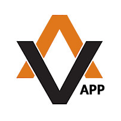

# Ismael Torres

## Quién soy

Soy un estudiante de segundo de DAW. **Aprendiendo** diversos *lenguajes* como *Java* y mas cosas




## Que lenguajes soy
Me gusta Django:

```python
aficiones = "furbol"

    print(aficiones)
```

Como arrancamos Django `python manage.py runserver`

## Dónde encontrarme

Este es mi *twitter* y *LinkedIn* [ismaeltorres.ofi@gmail.com](mailto:ismaeltorres.ofi@gmail.com)

Cosas que se

* SQL
* JAVA  
    1. Ficheros
    1. Colecciones
    1. Colecciones
    1. Colecciones
    1. Colecciones
* JAVASCRIPT
* Python
    * Django


Y los módulos que me han gustado han sido

| si | no 
| --- | ----
| Hola | Que tal
| Uno | Dos